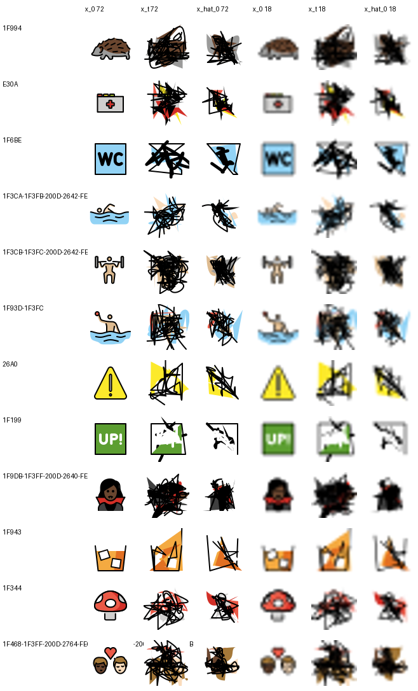

# What the v2 checkpoint actually predicts

The v2 data-scale run reported 0.2886 held-out aggregate token accuracy and 0.0573
changed-token accuracy at its selected step. Neither number says whether the model's
predicted clean state is a recognizable icon with some fields wrong or is rubble. This
probe renders the triple for twelve held-out icons drawn from the pilot's own 128-icon
validation set, using the pilot's own held-out corruption generator, so the pictures
show exactly the inputs those scalars were computed on.

It is descriptive and carries no predeclared criteria. It trains nothing.

## Result

| state and size | median RGBA MAE against `x_0` |
| --- | ---: |
| `x_t` 72 px | 0.169546 |
| `x_hat_0` 72 px | 0.142433 |
| `x_t` 18 px | 0.182875 |
| `x_hat_0` 18 px | 0.152770 |

The prediction reduces median RGBA error against the clean render by 16.0% at 72 px and
16.5% at 18 px relative to the corrupted input it was given. A second complete
invocation reproduced every artifact hash.

## Reading the sheet

None of the twelve predictions is a recognizable icon. Both `x_t` and `x_hat_0` read as
scribble at both sizes.

What does survive is instructive. Fills, styles, and topology are not corrupted by this
process - only geometry fields are - so large flat colour regions come through intact:
the warning triangle `26A0` keeps its yellow field, the tumbler `1F943` its orange, the
`1F199` badge its green. The stroke geometry is destroyed in every case. On a few icons
the prediction is visibly less tangled than the corrupted input; on others the two are
indistinguishable.

## What this changes

Two things, and the second matters more.

First, the Gate G scalars oversell the visual result substantially. A 16% reduction in
median render error is not a recovered icon, and 0.2886 aggregate token accuracy should
not be read as one. Any future claim about Gate G recovery needs a render beside it.

Second, at corruption probability 0.35 the input `x_t` is *already* visually destroyed.
The model is being trained and evaluated at a corruption level where the visual task may
not be achievable at any model size, because a third of the geometry is simply gone. The
project has held this probability fixed since the Gate F fixtures, where it was chosen
for four-icon experiments, and has never varied it at corpus scale. That makes the
corruption schedule a first-class candidate factor for the next experiment rather than a
secondary one, and it argues for training across a range of corruption levels rather
than at a single fixed point.

This is twelve icons at one corruption draw and one probability. It is a description of
one checkpoint, not a benchmark.
